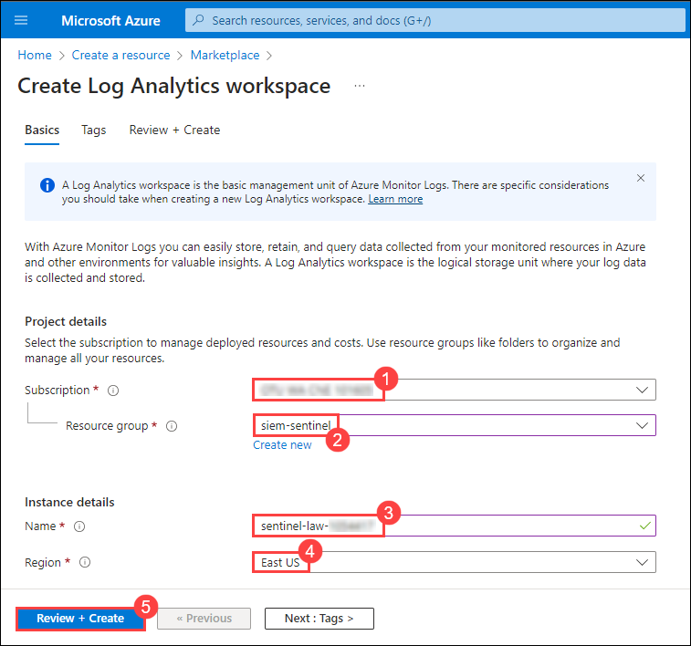
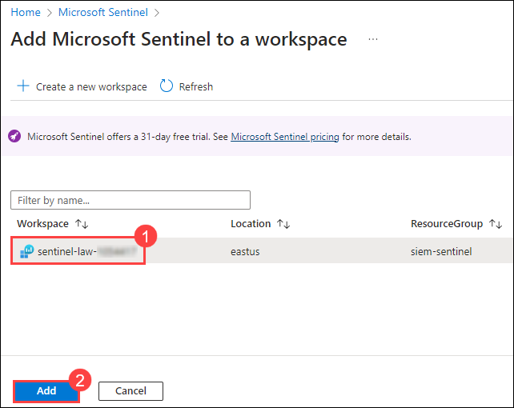

# Exercise 1: Deploying Azure Sentinel and Onboarding Cloud Resources and Servers

### Duration: 30 minutes

## Scenario 

Contoso is looking to enhance its cybersecurity posture by implementing a robust cloud-native Security Information and Event Management (SIEM) solution. After careful consideration, the decision has been made to deploy Azure Sentinel and Microsoft's cloud-native SIEM solution. As part of this initiative, you need to onboard various cloud resources and servers to Azure Sentinel for comprehensive security monitoring and threat detection.

## Overview

<-- To be added --> 

This exercise includes the following tasks:

* [Task 1: Enable Azure Sentinel](#task-1-provision-virtual-network)
* [Task 2: Onboard Azure resources and server to Azure Sentinel using Data connectors](#task-2-provision-subnets)

## Task 1: Enable Azure Sentinel

This task includes the creation of Log Analytics Workspace and initialization of the Microsoft Sentinel Workspace.

### Task 1.1 : Create Log Analytics Workspace

1.  In the Azure Portal, from the upper left corner select **menu (1)** icon with three lines as highlighted below and then select **+ Create a resource (2)**.

      

2. In the search box, type **Log Analytics Workspace** and select it from the search result.
   
      
   
3. Within the Marketplace page, click on **Create (1)** and select **Log Analytics Workspace (2)** from the **Log Analytics Workspace** resource card.

      

4. On the **Basics** tab of the **Create Log Analytics workspace**, enter the following details:
   
      -  **Subscription:** Select the default assigned subscription **(1)**
      -  **Resource group:** Select **siem-sentinel** resource group from the drop down list **(2)**
      -  **Name:**  Enter **sentinel-law-<inject key="Deployment-id" enableCopy="false"></inject> (3)**
      -  **Region:** Select **East US (4)**
      -  Click on **Review + Create (5)**

      

5. Once the workspace validation has passed, select **Create**. Wait for the new workspace to be provisioned, this may take a couple of minutes.
6. Soon after successful deployment of the **Microsoft.LogAnalyticsOMS**, on the overview page, click on **Go to resource** inorder to view the newly created Log Analytics Workspace.

      

### Task 1.2 : Initialize the Microsoft Sentinel Workspace

1. In the Search bar of the Azure portal, type **Sentinel** (1) and select **Microsoft Sentinel** (2) from the list of search results.

      

2. Within the Microsoft Sentinel home page, click on **+ Create** to create and configure the Sentinel Workspace.

      

3. On the **Add Microsoft Sentinel to a workspace** page, select the existing workspace i.e, **sentinel-law-<inject key="Deployment-id" enableCopy="false"></inject> (1)** which was created in the previous task, then select **Add (2)**. This could take a few minutes.

      

4. Navigate around the newly created Microsoft Sentinel workspace to become familiar with the user interface options.

      >**Note**: The Microsoft Sentinel is deployed with a one month free trail activation period.

## Task 2: Onboard Azure resources and server to Azure Sentinel using data connectors

This task includes the establishement of a connection between Windows and M365 data to Sentinel workspace.

### Task 2.1 : Connect an Azure Windows Virtual Machine to Microsoft Sentinel

 1. In the Search bar of the Azure portal, type **Sentinel (1)**, then select **Microsoft Sentinel (2)**.

      

 2. Select the Microsoft Sentinel Workspace you created earlier.
 
 3. Within the Microsoft Sentinel page, in the left navigation pane, click on **Conent hub (1)** under the **Content management** section. Search **(2)** for and select **(3)** **Windows Security Events**. Click on the **Install (4)** button in the right navigation pane that shows up thus, resulting in installation of the Windows Security Events Solution.

      

      >**Note**: The installation may take upto a minute. Wait for the **Install Success** notification after which you can now notice the **Installed** count has increased to **1**.

      
       
 4. From the **Data Connectors (1)** tab, under the **Configuration** section in the left navigation pane of the Microsoft Sentinel page, select the **Windows Security Events via AMA (2)** connector from the available list and click on **Open connector page (3)** from the right navigation that shows up.

      

 5. In the Configuration section of the **Windows Security Events via AMA** page, select the **+Create data collection rule**.

      

 6. On the **Basics** tab of the **Create Data Collection Rule** pane, enter the following details:

      -  **Rule Name**: **windows-security-events-dcr** - (1)
      -  **Subscription:** Select the default assigned subscription - - (2)
      -  **Resource group:** Select **siem-sentinel** resource group from the drop down list - (3)
      -  Select **Next: Resources >** - (4) 

      

 7. Under the **Resources** tab, select **+Add resource(s)**.

      

 8. Expand the resource group **siem-sentinel (1)**,  select the windows virtual machine named **labvm-<inject key="Deployment-id" enableCopy="false"> (2)** and then click on **Apply (3)**.

      

      >**Note**: This lab is provided with a pre-created windows virtual machine (for the ease of the users) which can be added as a resource to connect with Microsoft Sentinel.

 9. Back on the **Create Data Collection Rule** page, select **Next: Collect >** and then **Next: Review + create**.

 10. After the successful validation run, click on **Create**.

      >**Note**: Wait for the **Successfully installed extension** notification within the azure portal implying that the DCR has been created along with the AMA being installed succssfully. Select **Refresh** to see the new data collection rule listed.

11. Going back to the **Microsoft Sentinel | Data connectors** page, notice that now the **Windows Security Events via AMA** data connector is successfully connected with Microsoft Sentinel.

      

### Task 2.2 : Connect M365 data to Sentinel using Data connectors

1. In the Search bar of the Azure portal, type **Sentinel (1)**, then select **Microsoft Sentinel (2)**.

      

 2. Select the Microsoft Sentinel Workspace you created earlier.
 
 3. Within the Microsoft Sentinel page, in the left navigation pane, click on **Conent hub (1)** under the **Content management** section. Search **(2)** for and select **(3)** **Microsoft 365**. Click on the **Install (4)** button in the right navigation pane that shows up thus, resulting in installation of the Microsoft 365 Solution.

      

      >**Note**: The installation may take upto a minute. Wait for the **Install Success** notification after which you can now notice that the **Installed** count has been increased to **2**.

       

 4. From the **Data Connectors (1)** tab, under the **Configuration** section in the left navigation pane of the Microsoft Sentinel page, select the **Microsoft 365 (2)** connector from the available list and click on **Open connector page (3)** from the right navigation that shows up.

      >**Note**: You might have to refresh the Microsoft | Data connectors page inorder to view the Microsoft 365 connector.

      

5. In the Configuration section of the **Microsoft 365** page, ensure to select all the three check boxes **(1)** analogous to **Exchange**, **SharePoint** and **Teams** respectively. Click on **Apply Changes (2)**.

      

   >**Note**: This lab is provided with required read/write access to the Sentinel workspace along with the tentant having Security Administrator permissions inorder to pre-handedly meet the prerequisites of successfully connecting data connectors.

7. Upon receiving the *Success* notification (which can be view from the notifications panel) within the Azure portal, implies that the Microsoft 365 data connector has been successfully connected with Microsoft Sentinel. This can also be validated by the change in the status to **Connected** as shown in the below screenshot:

      

   
