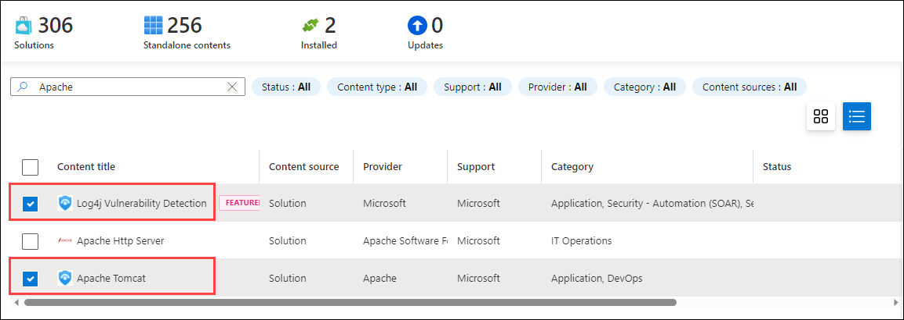
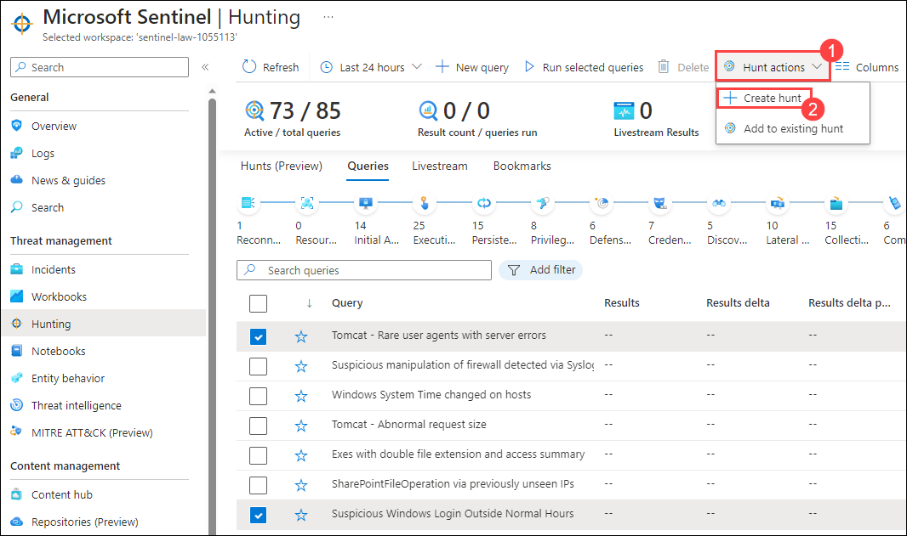
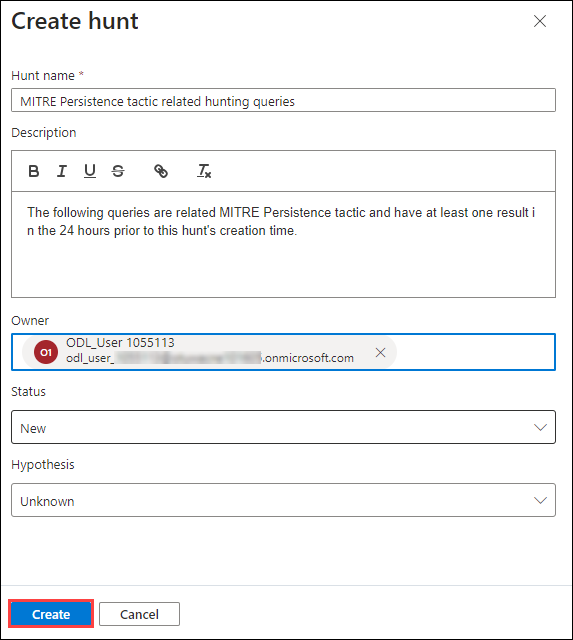
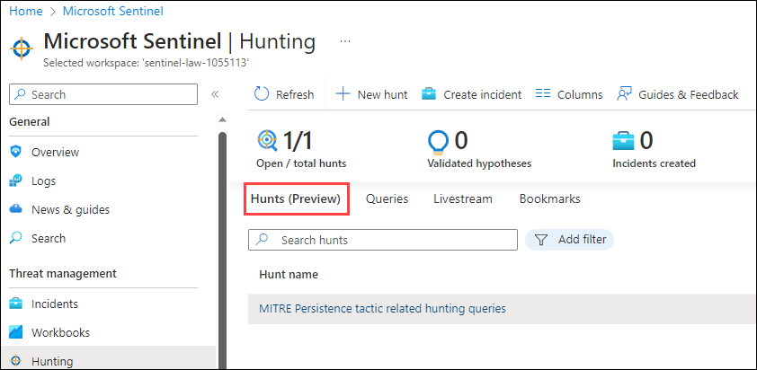
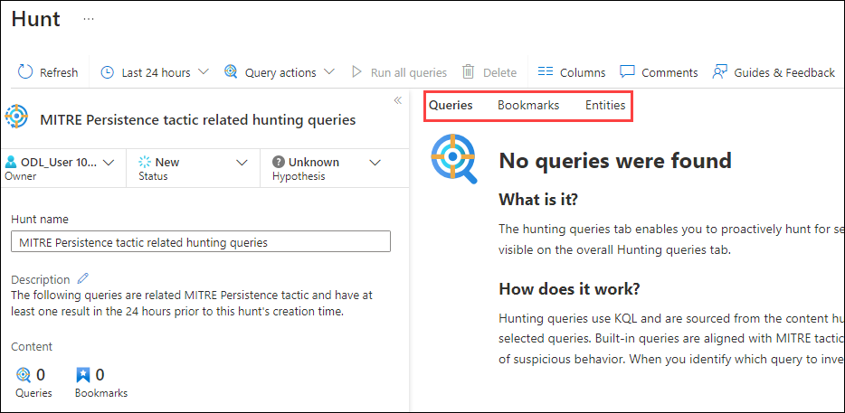
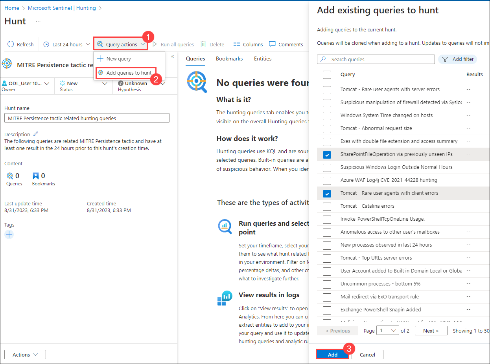
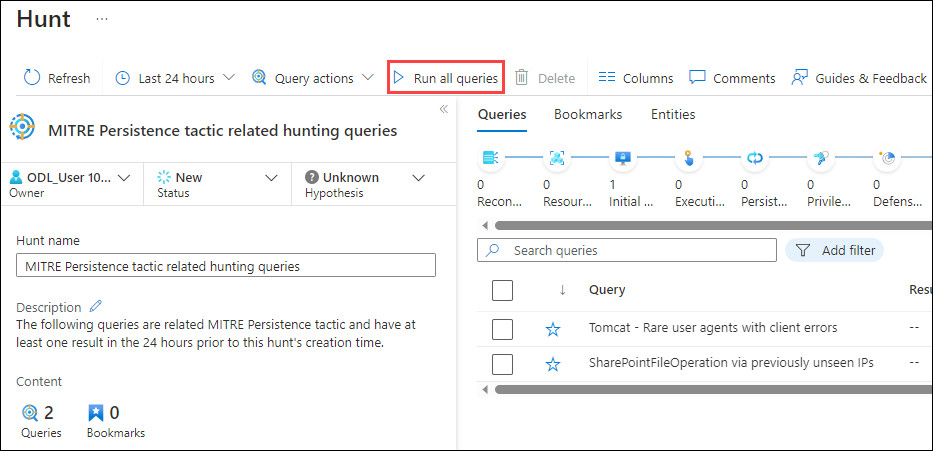
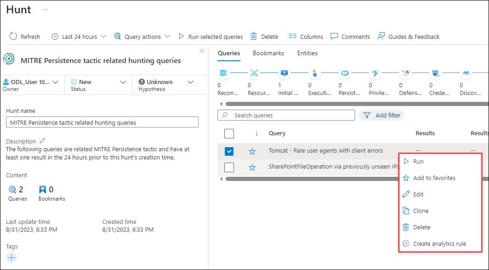
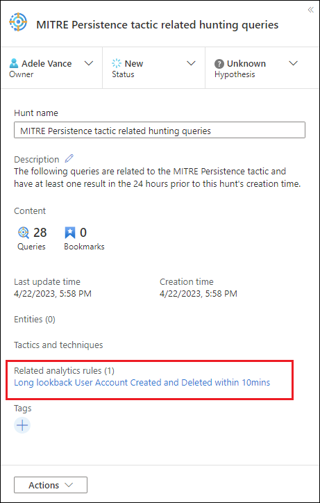

# Exercise 2: Conducting log analytics and Threat hunting

### Duration: 30 minutes

## Scenario 

Contoso is looking to enhance its cybersecurity posture by implementing a robust cloud-native Security Information and Event Management (SIEM) solution. After careful consideration, the decision has been made to deploy Azure Sentinel and Microsoft's cloud-native SIEM solution. As part of this initiative, you need to onboard various cloud resources and servers to Azure Sentinel for comprehensive security monitoring and threat detection.

## Overview

<-- To be added --> 

This exercise includes the following tasks:

* [Task 1: Enable Azure Sentinel](#task-1-enable-azure-sentinel)
* [Task 2: Onboard Azure resources and server to Azure Sentinel using Data connectors](#task-2-onboard-azure-resources-and-server-to-azure-sentinel)

## Task 1: Define your hypothesis

Defining a hypothesis is an open ended, flexible process and can include any idea you want to validate. Common hypotheses include:
 - **Suspicious behavior** - Investigate potentially malicious activity that's visible in your environment to determine if an attack is occurring.
 - **New threat campaign** - Look for types of malicious activity based on newly discovered threat actors, techniques, or vulnerabilities. This might be something you've heard about in a security news article.
 - **Detection gaps** - Increase your detection coverage using the MITRE ATT&CK map to identify gaps.

Microsoft Sentinel gives you flexibility as you zero in on the right set of hunting queries to investigate your hypothesis. When you create a hunt, initiate it with preselected hunting queries or add queries as you progress.

### Task 1.1 : Hypothesis - Suspicious behavior

1. In the Search bar of the Azure portal, type **Sentinel**, then select **Microsoft Sentinel**.

      

2. Select the Microsoft Sentinel Workspace you created earlier.

3. Navigate to the Hunting page Queries tab by clicking on **Hunting** (1) under the **Threat management** section within the left navigation pane of the Microsoft Sentinel page and then select the **Queries** tab.

      

4. Select **Run all queries** and wait for the queries to execute. This process may take time.

      

      >**Note**: With a well-established base of queries installed, running all your queries is the recommended method for identifying potentially malicious behaviors.
      >**Note**: Sorting the results by the Results Delta column to understand most recent changes. These results provide initial guidance on the hunt.

### Task 1.2 : Hypothesis - New threat campaign

Content hub offers threat campaign and domain-based solutions to hunt for specific attacks.

1. Install the **Log4J Vulnerability Detection** or the **Apache Tomcat** solutions from content hub.

      

2. Once installed, you can create a hunt directly from the solution by selecting the installed solution, then the **Actions** button from the right navigation pane that appears and finally clicking on **+ Create hunt (preview)**.

      

      >**Note**: If you already have a hunt started, you can select **Add to existing hunt (Preview)** inorder to add queries from the solution to an existing hunt.

3. Alternatively, you can search for queries from these solutions in the Hunting Queries tab. Search by solution name, or filtering by Source Name of the solution.

### Task 1.3 : Hypothesis - Detection gaps

The MITRE ATT&CK map helps you identify specific gaps in your detection coverage. Use predefined hunting queries for specific MITRE ATT&CK techniques as a starting point to develop new detection logic.

1. Navigate to the MITRE ATT&CK (Preview) page by clicking on **MITRE ATT&CK (Preview)** under the **Threat management** section within the left navigation pane of the Microsoft Sentinel page.

2. Unselect items (1) in the Active drop-down menu and select **Hunting queries** in the Simulated filter to see which techniques have hunting queries associated with them.

      

3. Select the card with your desired technique.

4. Select the **View** link next to Hunting queries at the bottom of the details pane. This link takes you to a filtered view of the Queries tab on the Hunting page based on the technique you selected. 

      

5. Select all the queries for that technique.

## Task 2: Create a Hunt

There are two primary ways to create a hunt:

1. In the **Queries** tab of the **Microsoft Sentinel | Hunting** page, if you've started with a hypothesis where you've selected certain queries, select the **Hunt actions** drop down menu (1) and click on **+ Create hunt**. All the queries you selected are cloned for this new hunt.

      

2. If you haven't decided on queries yet, navigate to the **Hunts (Preview)** tab (1) of the **Microsoft Sentinel | Hunting** page and then click on **+ New Hunt** (2) to create a blank hunt.

      

3. Fill out the hunt name and optional fields. The description is a good place to verbalize your hypothesis. The Hypothesis pull down menu is where you set the status of your working hypothesis. Select **Create** to get started.

      

### Task 2.1: View Hunt Details

1. Select the **Hunts (Preview)** tab within the **Microsoft Sentinel | Hunting** page to view the newly created hunt. 

   

2. Select the hunt link by name to view the details such as **Hunt name**, **Description**, **Content**, **Last update time**, and **Creation time** inroder to take appropriate actions.

3. Note the tabs for **Queries**, **Bookmarks**, and **Entities** to get more insights.

   

## Task 3: Add a query to the hunt

The **Queries tab** contains hunting queries specific to a hunt. These queries are clones of the originals, independent from all others in the workspace and can be updated or deleted without impacting your overall set of hunting queries or queries in other hunts.

1. Navigate to the **Hunts (Preview)** tab within the **Microsoft Sentinel | Hunting** page and select the newly created hunt link by name which directs to the **Hunt** details page.

2. Click on the **Query actions** dropdown (1) and select the **Add queries to hunt** (2) option. Within the **Add existing queries to hunt** page, select the required queries from the list the and then click on **Add** (3) to adjoin the selected queries to the current hunt. 

    

3. Staying on the current **Hunt** page having a list of all the selected queries which were added to the hunt in the previous step, click on **Run all queries** or choose specific queries and select **Run selected queries** inorder to run the queries.

   >**Note**: The **Cancel** button can be used to cancel query execution at any time.

   

### Task 3.1: Manage queries

1. Staying on the current **Hunt** page having a list of all the selected queries which were added to the hunt in the previous task, right-click a query and select one of the following from the context menu: 

   - Run
   - Edit
   - Clone
   - Delete
   - Create analytics rule
  
   

   >**Note**: These options behave just like the existing queries table in the Hunting page, except the actions only apply within this hunt.

2. When you choose to create an analytics rule by selecting the **Create analytics rule** from the list of manage options, the name, description, and KQL query is prepopulated in the new rule creation. A link is created to view the new analytics rule found under Related analytics rules. 

   

## Task 4: Add and view the bookmark

