# Exercise 2: Conducting log analytics and Threat hunting

### Duration: 30 minutes

## Scenario 

Contoso as a global organization have deployed Azure Sentinel and Microsoft's cloud-native SIEM as a part of their initiative to onboard its cloud resources & server to proactively inverstigate and address the concerns based on potential insider threats and attacks. Thus, Contoso plans on leveraging the services of Microsoft Sentinel for defining a hypothesis, creating a hunt, managing queries, adding bookmarks, interacting with entities, creating incidents, and tracking metrics leading to improved overall security posture.

## Overview

Azure Sentinel leverages Azure Monitor Logs and the Kusto Query Language (KQL) for log analytics. It offers a comprehensive approach to threat detection, incident management, threat hunting, and reporting:

  - **Log Analytics**: Azure Sentinel uses Azure Monitor Logs and KQL for custom queries to analyze log data, uncovering security insights and anomalies.
  - **Threat Detection**: It provides both built-in and custom detection rules, triggering alerts when suspicious events or behaviors are detected, including those informed by threat intelligence.
  - **Incident Management**: Azure Sentinel organizes related alerts into incidents, streamlining the investigation and response process for security analysts.
  - **Threat Hunting**: Security analysts engage in proactive threat hunting by creating custom hunting queries, using workbooks for visualization, and exploring security data to uncover potential threats.

You can find more references about threat detection and hunting in Microsoft Sentinel here: `https://learn.microsoft.com/en-us/azure/sentinel/hunting`

In this exercise you will understand & learn how to create, run and analyze the results of the queries based on specific hunts thus unvieling the possible attack points and threat mitigations.

This exercise includes the following tasks:

* [Task 1: Define your hypothesis](#task-1-define-your-hypothesis)
* [Task 2: Create a Hunt](#task-2-create-a-hunt)
* [Task 3: Add a query to the hunt](#task-3-add-a-query-to-the-hunt)
* [Task 4: Add and view the bookmark](#task-4-add-and-view-the-bookmark)
* [Task 5: Interact with entities](#task-5-interact-with-entities)
* [Task 6: Create incidents](#task-6-create-incidents)
* [Task 7: Track metrics](#task-7-track-metrics)

## Task 1: Define your hypothesis

Defining a hypothesis is an open ended, flexible process and can include any idea you want to validate. Common hypotheses include:
 - **Suspicious behavior** - Investigate potentially malicious activity that's visible in your environment to determine if an attack is occurring.
 - **New threat campaign** - Look for types of malicious activity based on newly discovered threat actors, techniques, or vulnerabilities. This might be something you've heard about in a security news article.
 - **Detection gaps** - Increase your detection coverage using the MITRE ATT&CK map to identify gaps.

Microsoft Sentinel gives you flexibility as you zero in on the right set of hunting queries to investigate your hypothesis.

### Task 1.1 : Hypothesis - Suspicious behavior

1. In the Search bar of the Azure portal, type **Sentinel (1)**, then select **Microsoft Sentinel (2)**.

      

2. Select the Microsoft Sentinel Workspace you created earlier. 

      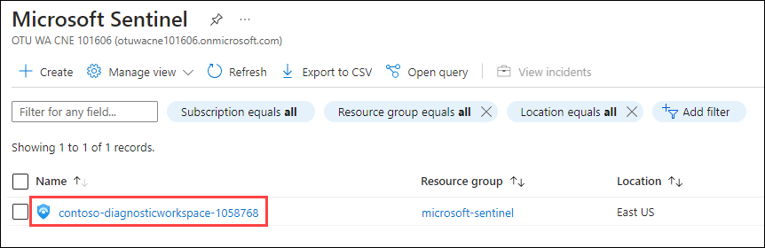

3. Select **Hunting (1)** under **Threat management** section within the left navigation pane of the Microsoft Sentinel page and then click on the **Queries (2)** tab.

      

4. Click on **Run all queries** and wait for the queries to execute. This process may take a couple of minutes.

      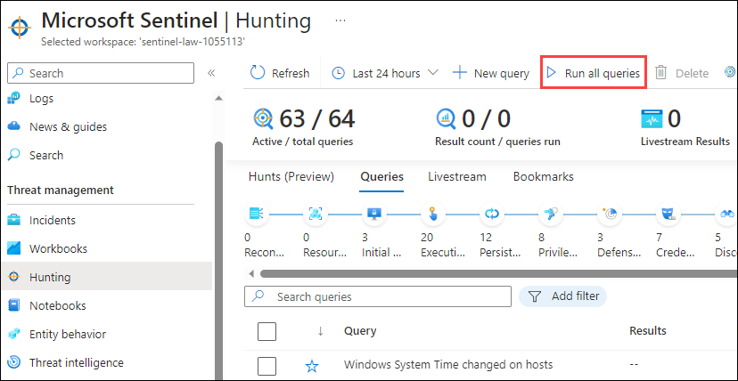

      >**Note**: With a well-established base of queries installed, running all your queries is the recommended method for identifying potentially malicious behaviors.

5. Notice the the **Result count** post the query runs within the metrics bar of the **Microsoft sentinel | Hunting** page. These results of the query runs appear for specific query logs having being identified.

      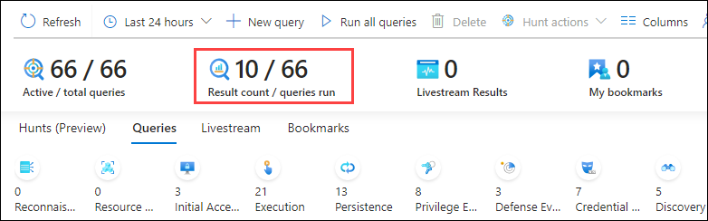

6. Click on the **Add filter (1)** button and then select **Results (2)** from the list of options that appear.

      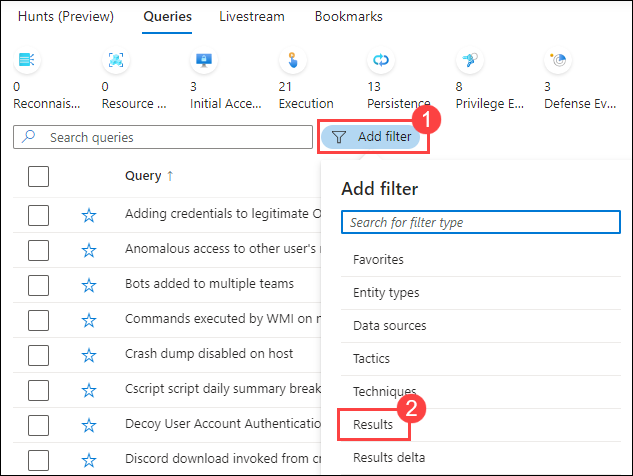

7. Within the **Results** pop-up dialog box,

    - Select the check boxes having values more than or equal to one **(1)**.
    - Click on **Apply (2)**.
   
    >**Note**: In this way, you can filter out the queries having atleast 1 result for better visibility. 

   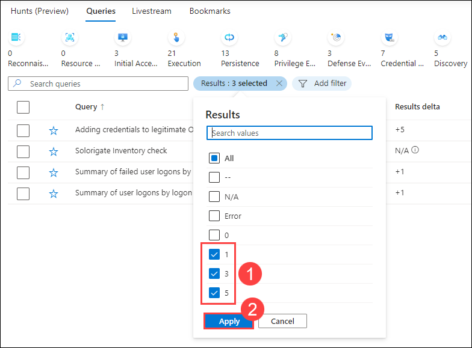

### Task 1.2 : Hypothesis - New threat campaign

Content hub offers threat campaign and domain-based solutions to hunt for specific attacks such as the **Log4J Vulnerability Detection** content.

1. On the Microsoft Sentinel page, follow the below instructions to install the data connector:

     - Click on **Content hub(1)** from the left navigation pane.
     - Search for **Log4J Vulnerability Detection (2)** from the search bar.
     - Select **Log4J Vulnerability Detection (3)** solution.
     - Click on **Install (4)** in the right navigation pane.

      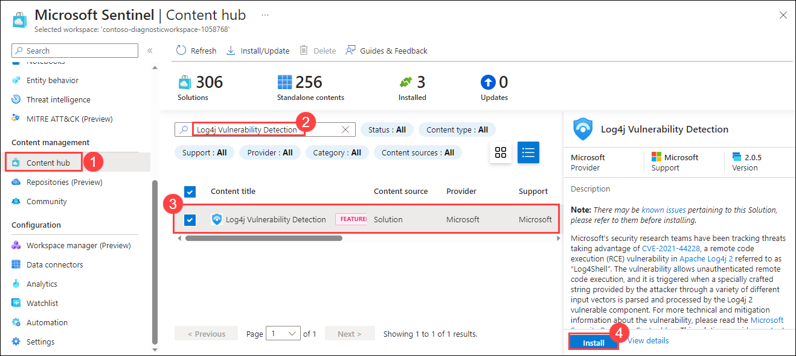

      >**Note**: The installation may take up to a minute. Wait for the **Install Success** notification, after which you can now notice the **Installed** count has increased to **4**.

2. Once installed, select **Log4J Vulnerability Detection** solution and perform the following:

    - Click on the **Actions (1)** button from the right navigation pane.
    - Select the **+ Create hunt (preview) (2)** to create a new hunt directly from the content hub page.

   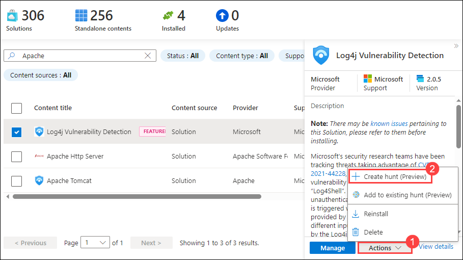

   >**Note**: The **Add to existing hunt (Preview)** option can be chosen inorder to add queries from the solution into an existing hunt.

5. On the **Create hunt** page, follow the below instructions to create a new hunt based on the installed **Log4J Vulnerability Detection** solution:

     - **Hunt name:** Log4J Vulnerability Detection **(1)**
     - **Owner:** Select **<inject key="AzureAdUserEmail"></inject>** **(2)**
     - **Status:** New **(3)**
     - **Hypothesis:** Unknown **(4)**

      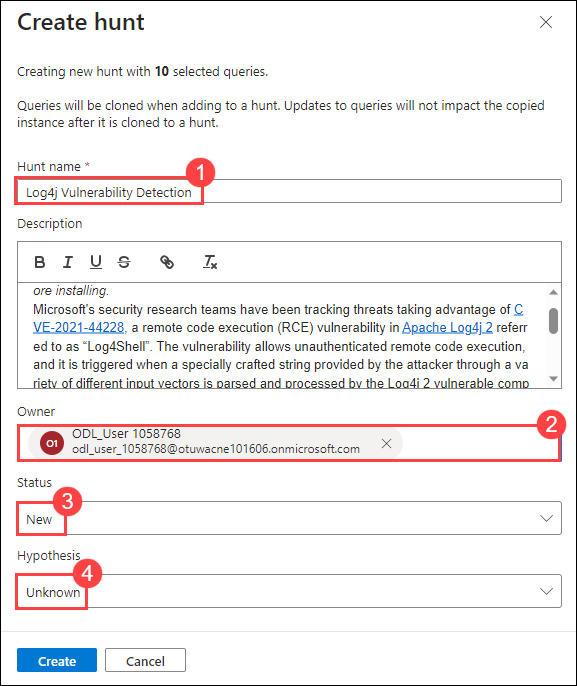

    >**Note**: Wait for the **Successfully created new hunt** notification.

6. Select **Hunting (1)** under **Threat management** section within the left navigation pane of the Microsoft Sentinel page and then click on the **Hunts (Preview) (2)** tab inorder to view the newly created hunt.

      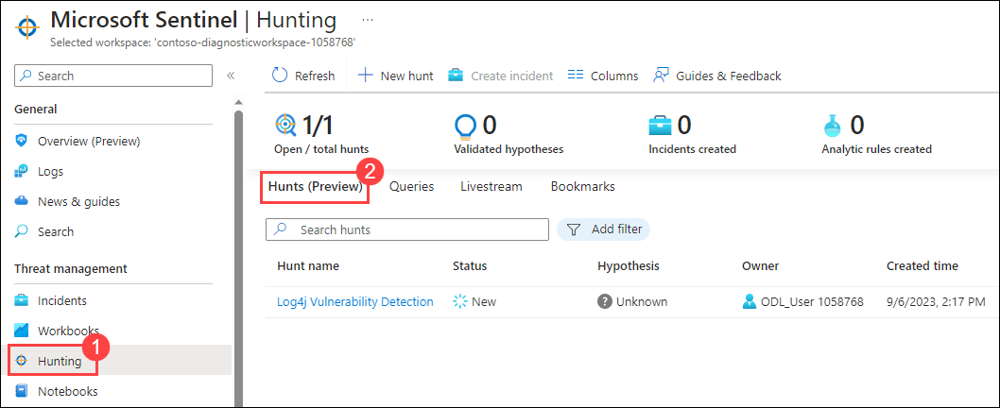

### Task 1.3 : Hypothesis - Detection gaps

The MITRE ATT&CK map helps you identify specific gaps in your detection coverage. Use predefined hunting queries for specific MITRE ATT&CK techniques as a starting point to develop new detection logic.

1. Click on **MITRE ATT&CK (Preview) (1)** under **Threat management** section within the left navigation pane of the Microsoft Sentinel page. Within the **Microsoft Sentinel | MITRE ATT&CK (Preview)** page, perform the following: 

    - **Active** dropdown filter: Unselect the all the check boxes. **(2)**
    - **Simulated** dropdown filter: Ensure only **Hunting queries** is selected. **(3)**

   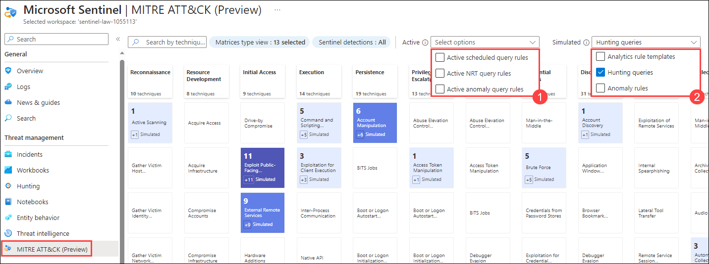

2. As an example, select the **Account Manipulation (1)** card and then click on **View (2)** link next to Hunting queries at the bottom of the details pane. This link takes you to a filtered view of the Queries tab on the Hunting page based on the technique you selected. 

      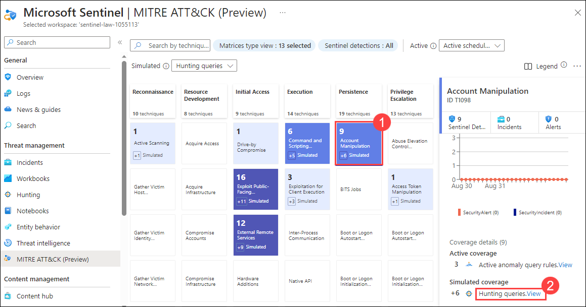

## Task 2: Create a Hunt

1. Select **Hunting (1)** under **Threat management** section within the left navigation pane of the Microsoft Sentinel page and click on the **Hunts (Preview) (2)** tab. Next, select **+ New hunt (3)** inorder to create a blank hunt.

      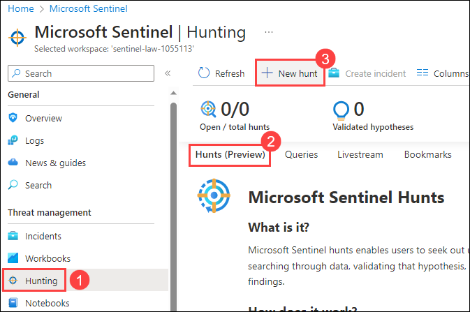

2. On the **Create hunt** page, follow the below instructions to create a new hunt:

     - **Hunt name:** Windows Security Events and M365 **(1)**
     - **Owner:** select **ODL_user <inject key="Deployment-id" enableCopy="false">** **(2)**
     - **Status:** New **(3)**
     - **Hypothesis:** Unknown **(4)**

      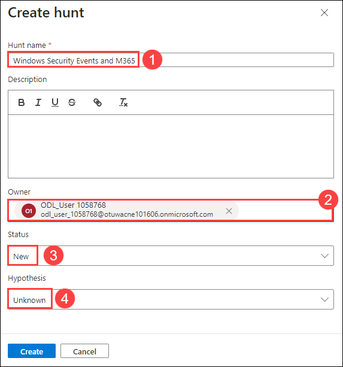

    >**Note**: Wait for the **Successfully created new hunt** notification.

### Task 2.1: Alternative way of creating a hunt [READ ONLY]

1. In the **Queries** tab of the **Microsoft Sentinel | Hunting** page, if you've started with a hypothesis where you've selected certain queries, select the **Hunt actions** drop down menu **(1)** and click on **+ Create hunt (2)**. All the queries you selected are cloned for this new hunt.

      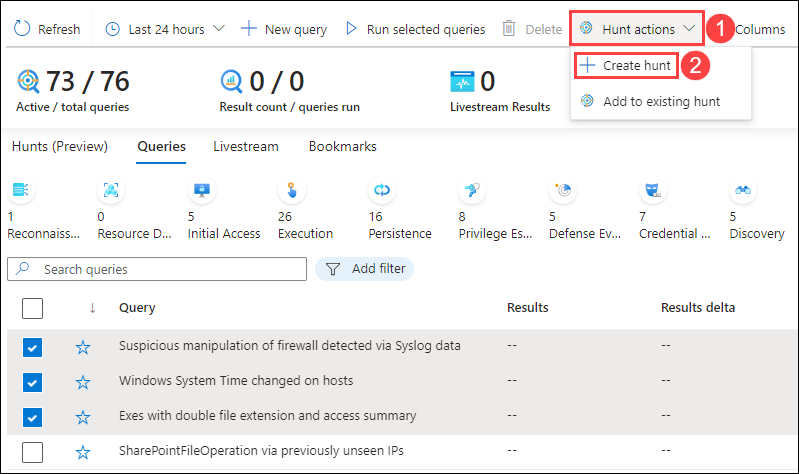

### Task 2.2: View Hunt Details

1. Select **Hunting** under **Threat management** section within the left navigation pane of the Microsoft Sentinel page and then click on the **Hunts (Preview)** tab inorder to view the newly created hunt.

2. Select the hunt link by name to view the details such as **Hunt name**, **Description**, **Content**, **Last update time**, and **Creation time** inorder to take appropriate actions.

    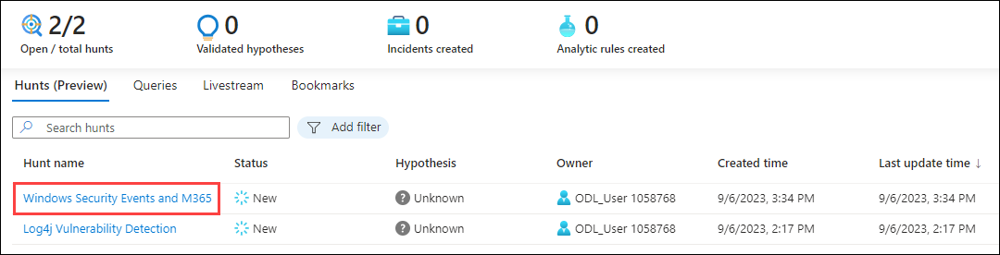

3. Navigate through the **Queries**, **Bookmarks**, and **Entities** tabs to get more insights.

   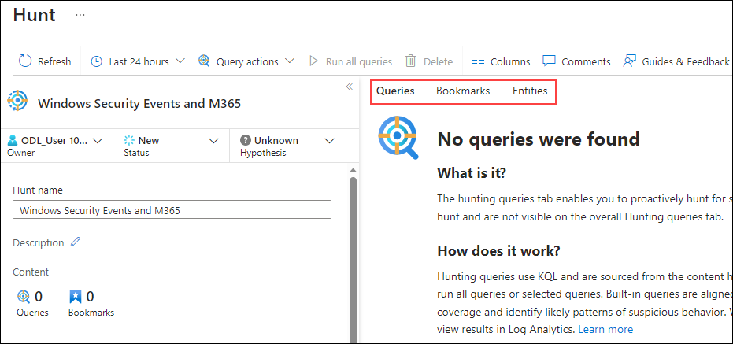

## Task 3: Add a query to the hunt

The **Queries tab** contains hunting queries specific to a hunt. These queries are clones of the originals, independent from all others in the workspace and can be updated or deleted without impacting your overall set of hunting queries or queries in other hunts.

1. Select **Hunting (1)** under **Threat management** section within the left navigation pane of the Microsoft Sentinel page and then click on the **Hunts (Preview) (2)** tab. Select the newly created blank hunt- **Windows Security Events and M365 (3)** to view the hunt details page.

      

2. Click on the **Query actions** dropdown **(1)** and select the **Add queries to hunt (2)** option. Within the **Add existing queries to hunt** page, select all queries **(3)** from the list the and then click on **Add (4)** to adjoin the selected queries to the current hunt. 

    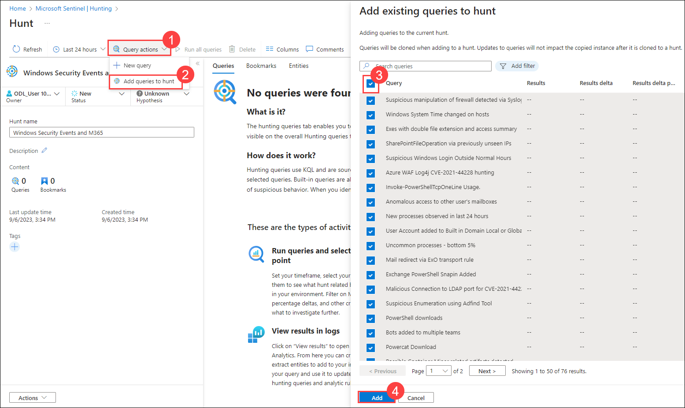

    >**Note:** The process adding queries may take a few sceonds. Wait for the **Successfully added queries to hunt** notification.

4. Staying on the current **Hunt** page having a list of all the selected queries which were added to the hunt in the previous step, click on **Run all queries** or choose specific queries and select **Run selected queries** inorder to run the queries.

   >**Note**: The **Cancel** button can be used to cancel query execution at any time.

   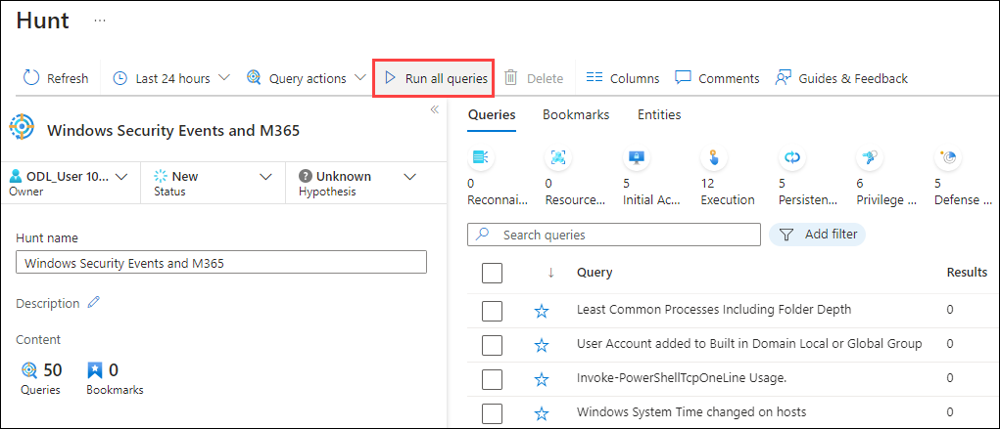

### Task 3.1: Manage queries

1. In the **Queries** tab of the *Windows Security Events and M365* **Hunt** page having a list of all the selected queries which were added to the hunt in the previous task, right-click a query and you can select one of the following from the context menu: 

   - Run
   - Edit
   - Clone
   - Delete
   - Create analytics rule
  
   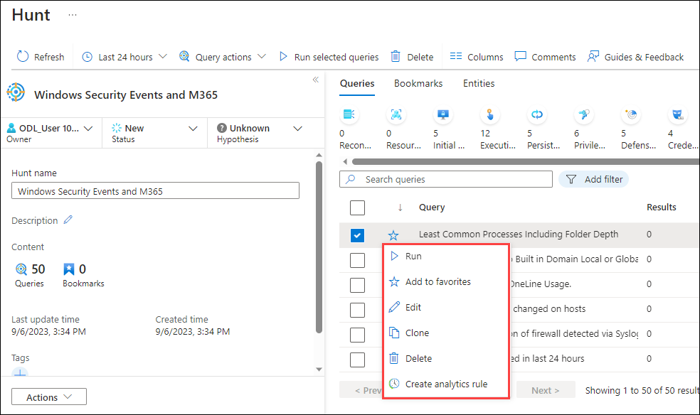

   >**Note**: These options behave just like the existing queries table in the Hunting page, except the actions only apply within this hunt.

2. Click on the **Create analytics rule** from the list of manage options to create a new analytics rule.

    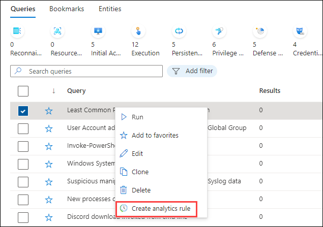

3. On the **Analytics rule wizard - Create a new Scheduled rule** page, leave all configurations at default and navigate to the **Review and create (1)** tab. Click on **Save (2)** to create the new scheduled rule.

    

   >**Note:** Wait for the **Analytics rule saved** notification implying that the rule has been successfully created. The name, description, and KQL query is prepopulated in the new rule creation.

5. On the *Windows Security Events and M365* hunt page, notice that a link is created to view the new analytics rule found under Related analytics rules. 

   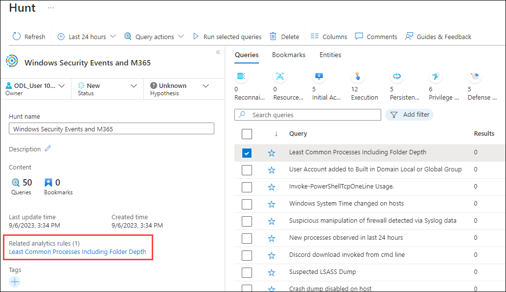

## Task 4: Add and view the bookmark

When you find interesting results or important rows of data, add those results to the hunt by creating a bookmark. For more infromation, refer to [Use hunting bookmarks for data investigations](https://learn.microsoft.com/en-us/azure/sentinel/bookmarks).

### Task 4.1: Add a bookmark

1. Select **Hunting** under **Threat management** section within the left navigation pane of the Microsoft Sentinel page and then click on the **Hunts (Preview)** tab. Select the hunt- **Windows Security Events and M365** to view the hunt details page.

2. In the **Hunt** details page, click on **Run all queries** and wait for the queries to run.

3. Filter the queries based on the result count such that it shows queries having a minimum of 1 result.

4. Select a query **(1)** from the filtered list and click **View results (2)** in hunting query details pane to view the result logs.

   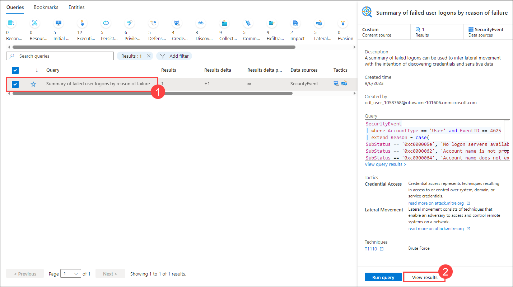

5. Use the check boxes to select rows that contain the information **(1)** and click on **Add bookmark (2)**. This preserves the data in the row for future reference. 

   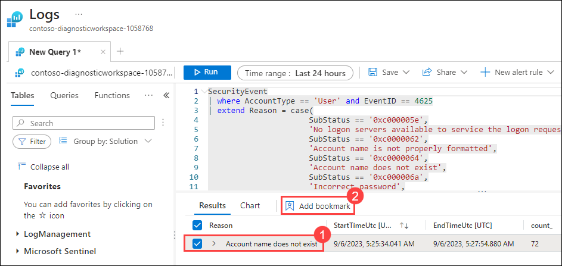

6. In the **Add bookmark** pane that shows up, note the default bookmark name **(1)** and click on the **Create (2)** button. Leave the other configurations on default.

    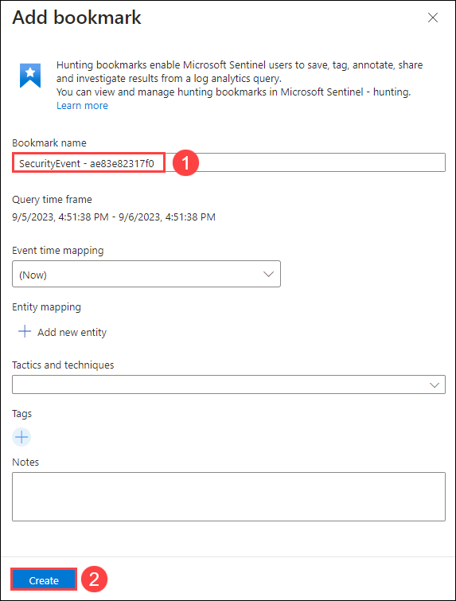

### Task 4.2: View bookmarks

1. Navigate to the *Windows Security Events and M365* hunt details page and click on the **Bookmarks** tab to view the newly created bookmark.

   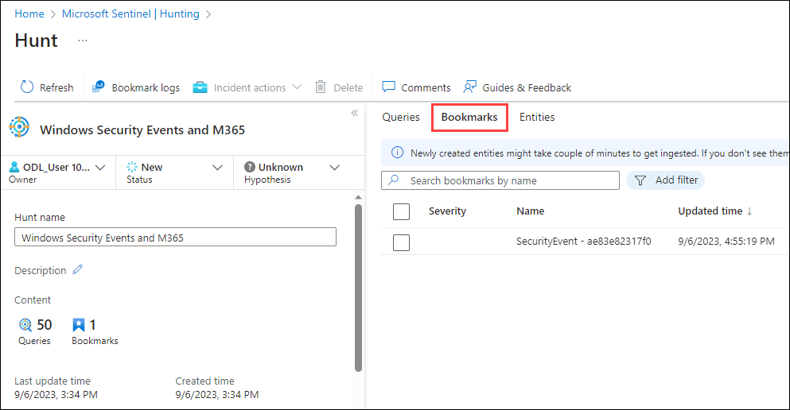

2. Select a desired bookmark and perform the following action from the Details pane on the right:
   - Select **View source query** to see the source query in Log Analytics.
   - Select **View bookmark logs** to see the bookmark contents in the Log Analytics hunting bookmark table.
   - Select **Investigate** button to view the bookmark and related entities in the investigation graph.
   - Select the **Edit** button to update the tags, MITRE tactics and techniques, and notes.

## Task 5: Interact with entities [READ-ONLY]

1. Navigate to your hunt's **Entities** tab to view, search, and filter the entities contained in your hunt. This list is generated from the list of entities in the bookmarks. The Entities tab automatically resolves duplicated entries.

   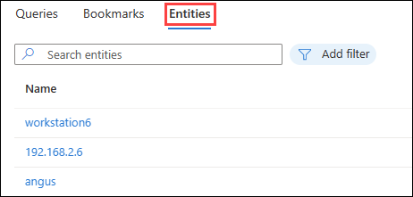

2. Select entity names to visit the corresponding UEBA entity page.

3. Right-click on the entity to take actions appropriate to the entity types, such as adding an IP address to TI or running an entity type specific playbook.

   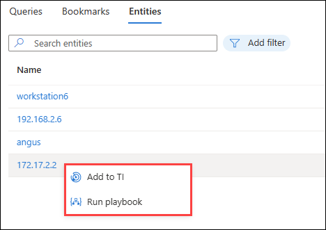

## Task 6: Create incidents

There are two choices for incident creation while hunting.

### Option 1: Use bookmarks

1. Navigate to your hunt's **Bookmarks (1)** tab and select the created bookmark **(2)**. Click on the **Incident actions (3)** dropdown and then select **Create incident (4)**.

   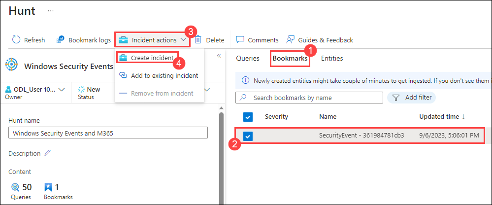

   >**Note:** In scenarios when you have an incident created, you can choose the **Add to existing incident** option.

2. On the **Create incident wizard** page, leave all the configurations on default and navigate to the **Review + create (1)** tab. Click on **Create (2)** to create the new incident.

   

   >**Note:** Wait for the **Successfully created incident** notification.

### Option 2: Use the Hunts Action [READ-ONLY]

1. Within the **Hunt** page, select the **Actions** (1) menu and then click on **Create incident** (2).

   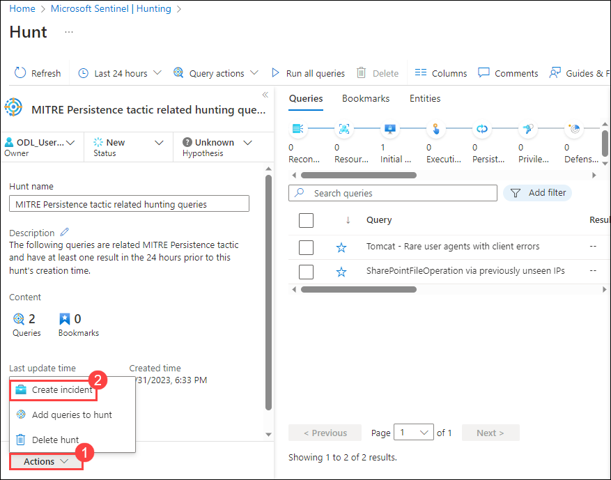

2. During the **Add bookmarks** step, use the **Add bookmark** action to choose bookmarks from the hunt to add to the incident. You're limited to bookmarks that haven't already been assigned to an incident.

3. After the incident is created, it will be linked under the **Related incidents** list for that hunt.

## Task 7: Track metrics

Track tangible results from hunting activity using the metrics bar in the **Hunts** tab. Metrics show the number of validated hypotheses, new incidents created, and new analytic rules created. Use these results to set goals or celebrate milestones of your hunting program.

   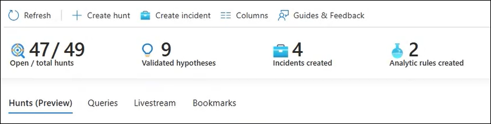
